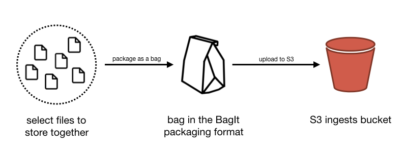

# Architecture of the storage service

This document explains how the storage service works, at an individual application level.
It is intended for developers who are actively working on the storage service.

It follows the lifecycle of a bag: from initial conception to successfully stored.

Last updated: 16 March 2020.

## Creating and uploading the bag

The user selects files they want to store together, and creates a bag using the [BagIt packaging format](https://tools.ietf.org/html/rfc8493).
They compress the bag as a tar.gz archive, and upload it to an S3 bucket (the "ingests bucket").

  
Who is "the user"?

  The user could be a person, but at Wellcome it's more likely to be an automated workflow management tool like Goobi or Archivematica.

## Triggering a new ingest

An *ingest* is a request to the storage service for it to store a bag.

To trigger an ingest, the user calls the ingests API, passing several parameters:

*   The space and external identifier (part of the bag identifier)
*   The location of the bag in the S3 ingests bucket

The ingests API returns an HTTP 201 Created response, and the *ingest ID*.
The user can use the ingest ID to track the process of an ingest through the storage service.

In the turn, the ingests API records the ingest in two places:

*   It writes the ingest to the *ingests table*, a DynamoDB table that records the state of every ingest
*   It notifies the pipeline by sending a message to an SNS topic (specifically, an SNS topic that is read by the bag unpacker)
